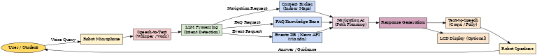

# 🤖 Autonomous Campus Guide – EduBot

> *“Imagine stepping onto a campus where finding your way is as simple as asking a friend.”*

The **Autonomous Campus Guide (EduBot)** is an **AI-powered robotic assistant** designed to enhance the university experience for students, newcomers, and visitors.  
By combining **speech recognition, LLMs, navigation AI, and contextual knowledge bases**, EduBot becomes a helpful companion that provides:

- 🎯 Seamless **indoor navigation** with step-by-step guidance  
- 💡 Instant answers to **FAQs and campus queries**  
- 🗣️ Conversational support with **natural dialogue**  
- 🔗 Integration with **live data** such as events, maps, and news  

EduBot transforms the campus into a **smart, interactive, and student-friendly environment**.  

---

## 📌 Use Cases  

### Use Case 1: Campus Navigation (Audio-Instruction Mode)  

**Scenario (IF … THEN …)**  

- **If** a student asks: *“How do I get to the robotics lab?”*  
  - **Then** the robot listens, transcribes speech to text, and detects `intent = navigation request`.  

- **If** the map database is accessible,  
  - **Then** the Navigation AI computes the **optimal route**.  

- **If** the path is clear,  
  - **Then** the robot explains:  
    *“Walk straight until you see the library, then turn left. The robotics lab is at the end of the hallway.”*  

- **If** the student says *“Repeat the last step”*,  
  - **Then** the robot clarifies with additional landmarks.  

✅ **Outcome**: The student successfully reaches the robotics lab.  

---

### Use Case 2: Campus FAQs & General Interaction  

**Scenario (IF … THEN …)**  

- **If** a student greets the robot,  
  - **Then** it replies: *“Hello! Welcome to campus. How can I help you today?”*  

- **If** the student asks: *“Where is the cafeteria?”*  
  - **Then** the robot answers: *“The cafeteria is in Building A, next to the main hall. It’s open until 6 PM.”*  

- **If** the student asks: *“What events are happening today?”*  
  - **Then** the robot fetches events and replies: *“The robotics workshop starts at 2 PM in Building B.”*  

- **If** the student says: *“I’m stressed about exams”*,  
  - **Then** the robot provides well-being advice and directs them to the counseling center.  

- **If** the robot does not know an answer,  
  - **Then** it replies: *“I don’t know yet, but you can check at the info desk.”*  

✅ **Outcome**: The student feels informed, supported, and engaged.  

---

## 🛠 System Documentation  

### 1. Actors & Roles  

- **Primary Actor**: Student, newcomer, visitor  
- **System**: Robot assistant (speech recognition, LLM, navigation AI)  
- **Supporting Systems**:  
  - Context Broker (FIWARE NGSI-LD) → indoor maps, building coordinates  
  - FAQ Knowledge Base → structured campus data (cafeteria, events, etc.)  
  - MCP Servers → modular AI services (LLM, NavAI, VLM)  
  - n8n Automation → orchestrates workflows (FAQ updates, event fetching)  

---

### 2. System Workflow  

1. **Voice Input** → Microphone captures speech (Whisper, Vosk, Google Speech API).  
2. **LLM Processing** → Detects intent (navigation, FAQ, or small talk).  
3. **Workflow Orchestration** → FIWARE ROS Agent + MCP servers + n8n integration.  
4. **Response Generation** → Navigation steps, FAQ answers, or dialogue.  
5. **Voice Output** → TTS via Coqui TTS, eSpeak, Amazon Polly + optional LCD.  

---

### 3. Role of VLM (Vision-Language Models)  

- Identifies landmarks visually (*“Look for the red doors”*).  
- Confirms destinations with real-time images.  
- Aids localization by aligning camera input with the map.  

---

### 4. Deployment Modes  

- **Fixed Robot (Info Desk)** → Stationary, voice guidance only.  
- **Mobile Escort (Future)** → Physically guides students through halls.  

---

### 5. System Architecture  

Here’s an illustration of the EduBot system architecture:  
👉 **SVG version** (crisper scaling):  
  

📂 **Download the files here**:  
- [png version](docs/edubot_architecture.png)  

---

## 🎯 Value Proposition  

- ✅ **Practical** → Students can navigate campus easily  
- 🤝 **Engaging** → Human-like conversations create trust  
- 🧩 **Modular** → Independent upgrades to AI components  
- 📈 **Scalable** → Integrates with events, maps, and news dynamically  

---

⚡ **With EduBot, every campus becomes a smart, connected, and student-friendly ecosystem.**
