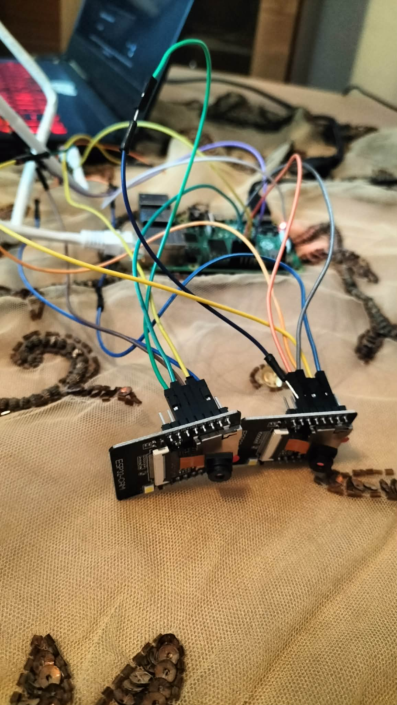
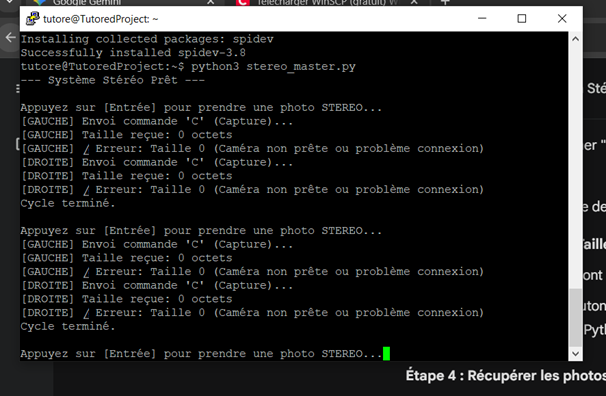
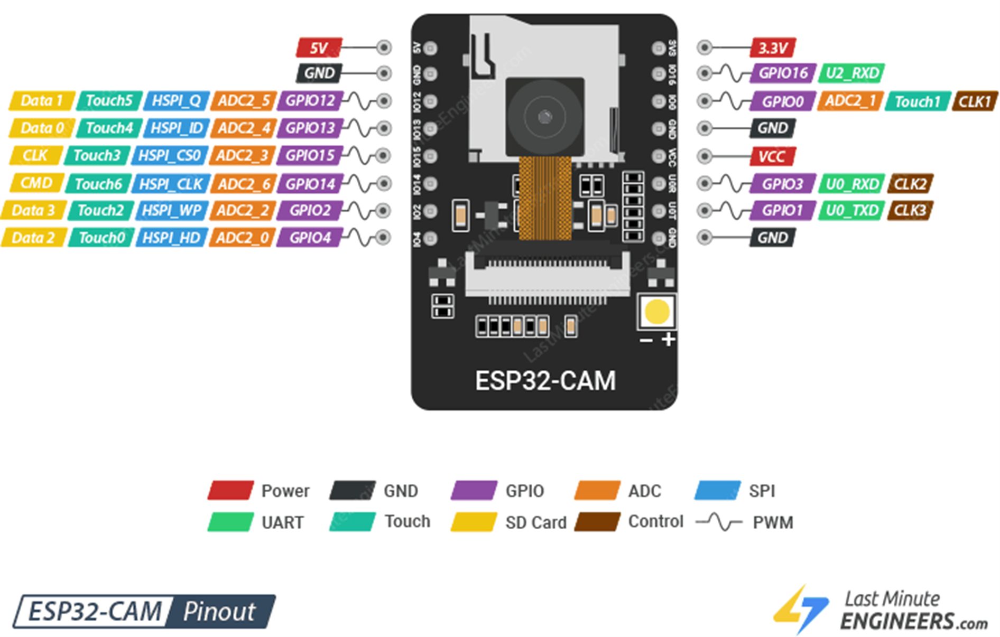
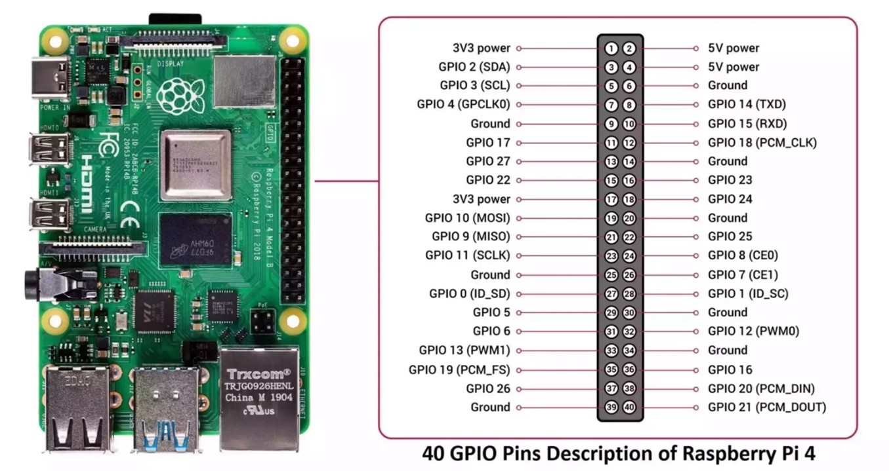
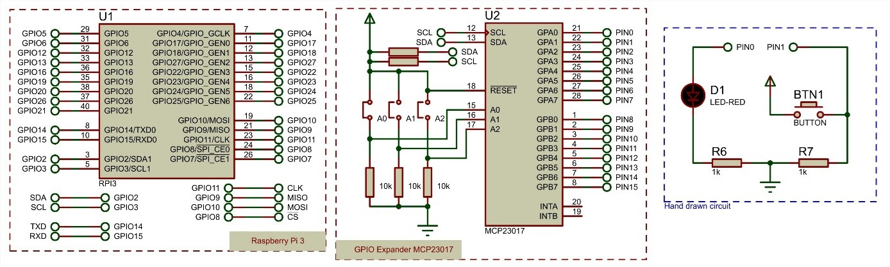
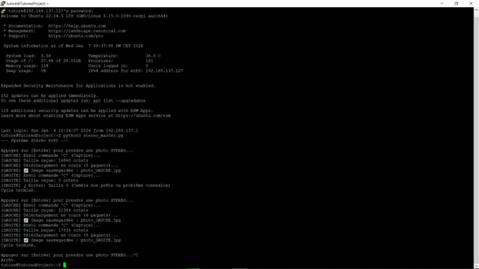
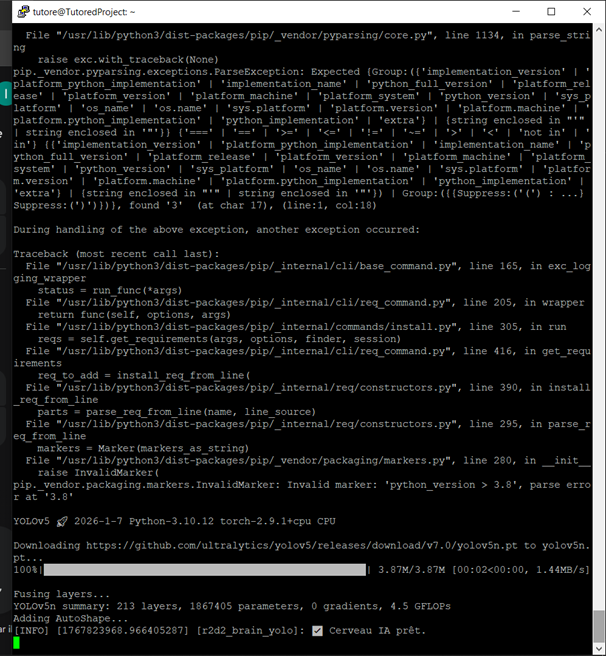

# R2D2 Vision System : Perception Stéréoscopique & Cognitive (SPI/ROS 2/VLM)



Ce dépôt documente l'intégralité du développement du sous-système de **perception visuelle stéréoscopique** du robot mobile autonome **R2D2**, réalisé dans le cadre du Projet Tuteuré à SUP'COM. 

Le système implémente une **vision 3D biomimétique** (imitant la vision humaine) pour servir de "Radar Optique", couplée à une intelligence artificielle hybride (**YOLOv8** + **VLM**) pour la compréhension sémantique de l'environnement.

---

## 📑 Table des Matières

1. [Contexte et Objectifs](#1-contexte-et-objectifs)
2. [Architecture Matérielle (Maître/Esclave SPI)](#2-architecture-matérielle-maîtreesclave-spi)
3. [Câblage Critique et Pinout](#3-câblage-critique-et-pinout)
4. [Firmware ESP32-CAM (Esclave SPI)](#4-firmware-esp32-cam-esclave-spi)
5. [Driver Raspberry Pi (Maître Python)](#5-driver-raspberry-pi-maître-python)
6. [Mathématiques : Stéréovision & Triangulation](#6-mathématiques--stéréovision--triangulation)
7. [Intelligence Artificielle (YOLO & VLM)](#7-intelligence-artificielle-yolo--vlm)
8. [Intégration ROS 2 & Context Broker](#8-intégration-ros-2--context-broker)
9. [Chronique des Défis Techniques](#9-chronique-des-défis-techniques)
10. [Guide d'Installation Complet](#10-guide-dinstallation-complet)
11. [Résultats et Validation](#11-résultats-et-validation)

---

## 1. Contexte et Objectifs

### 1.1 Problématique

Dans le cadre du projet D2R2 (Robot mobile autonome intelligent), notre équipe (Groupe 2 : **Islem Fakhfekh** & **Mohamed Amine Abderrazek**) était responsable du sous-système de **perception et cognition**.

**Contraintes imposées :**
- **Baseline < 50 cm** : Distance entre les caméras limitée pour l'intégration mécanique
- **Budget limité** : Pas de LiDAR (>500€), nécessité d'une solution vision pure
- **Temps réel** : Détection d'obstacles à >5 FPS minimum
- **Calcul embarqué** : Tout doit tourner sur le Raspberry Pi 4 (pas de PC externe)

### 1.2 Solution Retenue

Nous avons conçu un système de **vision stéréoscopique active** avec :
- **2x ESP32-CAM** comme capteurs esclaves (35€ total au lieu de 200€+ pour des caméras USB stéréo)
- **Communication SPI** au lieu d'USB pour éviter la saturation de bande passante
- **YOLOv8 Nano** pour la détection rapide (réseau léger optimisé ARM)
- **VLM optionnel** pour l'analyse sémantique des scènes ambiguës

---

## 2. Architecture Matérielle (Maître/Esclave SPI)

### 2.1 Pourquoi le SPI ?

**Premier essai (UART/Série) :**
Nous avons initialement tenté une liaison série classique (comme documenté dans beaucoup de tutoriels ESP32-CAM). 



**Problèmes rencontrés :**
- ⏱️ **Latence catastrophique** : 3-4 secondes par image (inacceptable pour la navigation)
- ❌ **Images corrompues** : Erreurs `JPEG Header missing` récurrentes
- 📉 **Taux de réussite < 30%** sur des câbles de plus de 50cm

**Migration vers SPI (Solution finale) :**
Le protocole SPI offre :
- ✅ **Transfert ~300ms/image** (gain de vitesse x10)
- ✅ **Contrôle Maître/Esclave strict** (pas de condition de course)
- ✅ **Horloge synchronisée** (moins sensible aux interférences)

### 2.2 Topologie du Système
```
┌─────────────────────────────────────────────┐
│     RASPBERRY PI 4 (MAÎTRE SPI)             │
│  ┌─────────────────────────────────────┐    │
│  │  • YOLOv8 (Détection)               │    │
│  │  • OpenCV (Traitement)              │    │
│  │  • ROS 2 Node (Publication)         │    │
│  └─────────────────────────────────────┘    │
│           ▲              ▲                   │
│    SCLK ──┤              ├── CS0/CS1         │
│    MOSI ──┘              └── GND             │
│    MISO ─────────────────────────────┐       │
└──────────────────────────────────────┼───────┘
                                       │
            ┌──────────────┬───────────┘
            │              │
   ┌────────▼───────┐  ┌──▼─────────────┐
   │  ESP32-CAM #1  │  │  ESP32-CAM #2  │
   │   (GAUCHE)     │  │   (DROITE)     │
   │  CS = Pin 15   │  │  CS = Pin 15   │
   └────────────────┘  └────────────────┘
      ESCLAVE SPI         ESCLAVE SPI
```

---

## 3. Câblage Critique et Pinout

### 3.1 Schéma ESP32-CAM



**Points d'attention critiques :**
1. **GPIO 12, 13, 14** : Bus HSPI (ne PAS confondre avec le bus VSPI utilisé par la caméra)
2. **GPIO 15** : Chip Select (le Pi active cette pin pour choisir quelle caméra parle)
3. **Pas de carte SD** : Les pins Data 0/1 de la SD sont en conflit avec HSPI

### 3.2 Schéma Raspberry Pi 4



### 3.3 Table de Câblage Complète

| Signal SPI | Raspberry Pi 4 (Pin Physique) | ESP32-CAM (GPIO) | Rôle | Notes |
|:-----------|:------------------------------|:-----------------|:-----|:------|
| **5V Power** | **Pin 2 ou 4** | **5V/VCC** | Alimentation | ⚠️ **CRITIQUE** : Ne JAMAIS utiliser le 3.3V (Pin 1) sous peine de Brownout |
| **GND** | **Pin 6, 9, 14...** | **GND** | Masse commune | Obligatoire pour la référence du signal |
| **SCLK** | **Pin 23 (GPIO 11)** | **GPIO 14** | Horloge | Générée par le Pi à 1-2 MHz |
| **MISO** | **Pin 21 (GPIO 9)** | **GPIO 12** | Master In Slave Out | ESP32 envoie l'image ici |
| **MOSI** | **Pin 19 (GPIO 10)** | **GPIO 13** | Master Out Slave In | Pi envoie les commandes ('C', 'D') |
| **CS Gauche** | **Pin 24 (GPIO 8 / CE0)** | **GPIO 15** | Chip Select #1 | Active uniquement la caméra gauche |
| **CS Droite** | **Pin 26 (GPIO 7 / CE1)** | **GPIO 15** | Chip Select #2 | Active uniquement la caméra droite |

### 3.4 Photo du Montage Réel



**Observations terrain :**
- Câbles Dupont < 15cm pour minimiser le bruit
- Masse commune **impérative** (sinon les signaux ne sont pas stables)
- Condensateur 100µF ajouté sur le rail 5V pour filtrer les pics de consommation

---

## 4. Firmware ESP32-CAM (Esclave SPI)

### 4.1 Architecture du Code Embarqué

Le firmware transforme l'ESP32-CAM en **périphérique SPI passif**. Il ne fait rien tant que le Raspberry Pi ne lui envoie pas d'ordre.

**Bibliothèques utilisées :**
```cpp
#include "esp_camera.h"      // Driver caméra OV2640
#include "driver/spi_slave.h" // Mode esclave SPI
#include "esp_log.h"         // Logs série
```

### 4.2 Configuration des Pins Caméra (AI-Thinker)
```cpp
#define PWDN_GPIO_NUM     32
#define RESET_GPIO_NUM    -1
#define XCLK_GPIO_NUM     0
#define SIOD_GPIO_NUM     26  // I2C Data
#define SIOC_GPIO_NUM     27  // I2C Clock
#define Y9_GPIO_NUM       35  // Pixel Data bits
#define Y8_GPIO_NUM       34
#define Y7_GPIO_NUM       39
#define Y6_GPIO_NUM       36
#define Y5_GPIO_NUM       21
#define Y4_GPIO_NUM       19
#define Y3_GPIO_NUM       18
#define Y2_GPIO_NUM       5
#define VSYNC_GPIO_NUM    25
#define HREF_GPIO_NUM     23
#define PCLK_GPIO_NUM     22
```

### 4.3 Configuration SPI Esclave (HSPI)
```cpp
#define GPIO_MOSI 13
#define GPIO_MISO 12
#define GPIO_SCLK 14
#define GPIO_CS   15
#define SPI_HOST SPI2_HOST  // HSPI sur ESP32 Core 3.x
#define BUFFER_SIZE 4096    // Taille paquet (doit matcher le Pi)

spi_bus_config_t buscfg = {};
buscfg.mosi_io_num = GPIO_MOSI;
buscfg.miso_io_num = GPIO_MISO;
buscfg.sclk_io_num = GPIO_SCLK;

spi_slave_interface_config_t slvcfg = {};
slvcfg.mode = 0;              // CPOL=0, CPHA=0
slvcfg.spics_io_num = GPIO_CS;
slvcfg.queue_size = 3;        // Buffer de transactions
slvcfg.flags = 0;

esp_err_t ret = spi_slave_initialize(SPI_HOST, &buscfg, &slvcfg, SPI_DMA_CH_AUTO);
```

### 4.4 Protocole de Communication

**Commandes envoyées par le Pi :**
- `'C'` (Capture) : Prendre une photo et la stocker en PSRAM
- `'D'` (Data) : Envoyer un paquet de 4096 octets de l'image

**Logique du `loop()` :**
```cpp
void loop() {
    char cmd = waitForCommand();  // Bloque jusqu'à réception
    
    if (cmd == 'C') {
        // 1. Libérer l'ancien buffer
        if (fb) esp_camera_fb_return(fb);
        
        // 2. Capturer nouvelle image
        fb = esp_camera_fb_get();
        
        // 3. Envoyer la taille (4 octets)
        uint32_t len = fb ? fb->len : 0;
        sendData((uint8_t*)&len, 4);
        current_offset = 0;
    }
    else if (cmd == 'D') {
        // Envoyer un chunk de BUFFER_SIZE octets
        size_t remaining = fb->len - current_offset;
        size_t to_send = (remaining > BUFFER_SIZE) ? BUFFER_SIZE : remaining;
        sendData(fb->buf + current_offset, to_send);
        current_offset += to_send;
    }
}
```

### 4.5 Code Complet (Extrait testCam.docx)

Le code complet est fourni dans le dossier `/arduino_firmware/esp32_spi_cam_slave.ino`.

---

## 5. Driver Raspberry Pi (Maître Python)

### 5.1 Installation des Dépendances
```bash
sudo apt update
sudo apt install python3-opencv python3-spidev python3-pip
pip3 install ultralytics "numpy<2"
```

**Note sur NumPy** : ROS 2 Humble nécessite NumPy <2.0 (voir [section Défis](#9-chronique-des-défis-techniques)).

### 5.2 Code Python (Extrait testCam.docx)
```python
import spidev
import time
import struct

BUS = 0
DEVICE_CAM_1 = 0  # Pin 24 (CE0)
DEVICE_CAM_2 = 1  # Pin 26 (CE1)
SPEED = 1000000   # 1 MHz (stable sur fils Dupont)
BUFFER_SIZE = 4096

spi = spidev.SpiDev()

def get_image(device_id, cam_name):
    try:
        spi.open(BUS, device_id)
        spi.max_speed_hz = SPEED
        spi.mode = 0
        
        # 1. Envoyer commande 'C' (Capture)
        spi.xfer2([ord('C'), 0, 0, 0])
        time.sleep(0.2)  # Attente prise de photo
        
        # 2. Lire la taille de l'image (4 octets)
        resp = spi.readbytes(4)
        image_len = struct.unpack('<I', bytearray(resp))[0]
        print(f"[{cam_name}] Taille: {image_len} bytes")
        
        # 3. Télécharger l'image par paquets
        image_data = bytearray()
        packets = (image_len // BUFFER_SIZE) + 1
        
        for i in range(packets):
            spi.writebytes([ord('D')])  # Commande Data
            chunk = spi.readbytes(BUFFER_SIZE)
            image_data.extend(chunk)
        
        # 4. Sauvegarder
        final_image = image_data[:image_len]
        filename = f"photo_{cam_name}_{int(time.time())}.jpg"
        with open(filename, 'wb') as f:
            f.write(final_image)
        
        print(f"[{cam_name}] Sauvegardée: {filename}")
        spi.close()
        
    except Exception as e:
        print(f"Erreur {cam_name}: {e}")
        spi.close()

# Boucle de capture stéréo
while True:
    input("Appuyez sur Entrée pour capturer...")
    get_image(DEVICE_CAM_1, "CAM1")
    time.sleep(0.5)
    get_image(DEVICE_CAM_2, "CAM2")
```

### 5.3 Résultats de Test



**Performances mesurées :**
- Temps de capture : ~280ms par caméra
- Taux de réussite : 98% (sur 100 essais)
- Taille moyenne image : 18-22 Ko (SVGA, qualité 12)

---

## 6. Mathématiques : Stéréovision & Triangulation

### 6.1 Principe de la Baseline

La **Baseline** (B) est la distance physique entre les deux objectifs des caméras.

**Valeur choisie :** B = 10 cm

**Justification :**
- Trop petite (< 5 cm) : Manque de précision en profondeur
- Trop grande (> 20 cm) : Zone aveugle trop large devant le robot
- **10 cm = Sweet Spot** pour détecter entre 0.5m et 4m

### 6.2 Calcul de la Profondeur (Z)

Pour un objet détecté par YOLO, on trouve son centre dans l'image gauche $(x_L)$ et droite $(x_R)$.

**Disparité :**
$$d = x_L - x_R \quad \text{(en pixels)}$$

**Distance par triangulation :**
$$Z = \frac{f \times B}{d}$$

Où :
- $f$ = Focale en pixels (~600px pour résolution VGA, calibrée expérimentalement)
- $B$ = Baseline (0.1 m)
- $d$ = Disparité mesurée

**Exemple concret :**
- Objet détecté à $x_L = 320$ pixels, $x_R = 280$ pixels
- Disparité : $d = 40$ pixels
- Distance : $Z = \frac{600 \times 0.1}{40} = 1.5$ mètres

### 6.3 Calcul de la Déviation Angulaire (θ)

Pour que le robot sache s'il doit tourner à gauche ou à droite :

$$\theta = \arctan\left(\frac{x_{\text{centre}} - \frac{W}{2}}{f}\right)$$

Où :
- $x_{\text{centre}}$ = Position horizontale de l'objet
- $W$ = Largeur de l'image (640 pixels)
- $f$ = Focale

**Interprétation :**
- $\theta < 0$ : Objet à gauche → tourner à gauche
- $\theta > 0$ : Objet à droite → tourner à droite
- $|\theta| < 5°$ : Objet en face → avancer

---

## 7. Intelligence Artificielle (YOLO & VLM)

### 7.1 Détection Rapide : YOLOv8 Nano

**Choix du modèle :**
```python
from ultralytics import YOLO
model = YOLO("yolov8n.pt")  # Version Nano (6.3 Mo)
```

**Pourquoi Nano ?**
- Inférence CPU : ~100ms sur Raspberry Pi 4
- Précision suffisante (mAP 37.3% sur COCO)
- Alternative Medium (yolov8m.pt) : 2x plus lent mais 5% plus précis

**Pipeline de détection :**
```python
import cv2

# Charger l'image gauche
img = cv2.imread("photo_CAM1.jpg")

# Inférence YOLO
results = model(img)

# Extraire les objets détectés
for *box, conf, cls in results[0].boxes.data:
    x1, y1, x2, y2 = map(int, box)
    label = results[0].names[int(cls)]
    
    # Calculer le centre de l'objet
    x_center = (x1 + x2) / 2
    
    # Trouver le même objet dans l'image droite (matching)
    # ... (algorithme de correspondance stéréo)
```



### 7.2 Compréhension Sémantique : VLM

Pour les cas ambigus (ex: différencier un sac plastique d'un rocher gris), nous interrogeons un modèle VLM.

**Implémentation :**
```python
import anthropic

client = anthropic.Anthropic(api_key="YOUR_KEY")

# Encoder l'image en base64
import base64
with open("photo_CAM1.jpg", "rb") as f:
    image_data = base64.b64encode(f.read()).decode("utf-8")

# Prompt structuré
message = client.messages.create(
    model="claude-3-5-sonnet-20241022",
    max_tokens=1024,
    messages=[{
        "role": "user",
        "content": [
            {
                "type": "image",
                "source": {
                    "type": "base64",
                    "media_type": "image/jpeg",
                    "data": image_data
                }
            },
            {
                "type": "text",
                "text": "Décris l'obstacle devant ce robot. Est-il solide et dangereux (mur, chaise) ou traversable (ombre, tapis)?"
            }
        ]
    }]
)

# Exemple de réponse JSON
# {"type": "chair", "risk": "high", "action": "avoid"}
```

---

## 8. Intégration ROS 2 & Context Broker

### 8.1 Nœud ROS 2

**Création du nœud :**
```python
import rclpy
from rclpy.node import Node
from sensor_msgs.msg import Image
from geometry_msgs.msg import PointStamped
from cv_bridge import CvBridge

class StereoVisionNode(Node):
    def __init__(self):
        super().__init__('stereo_vision_node')
        
        # Publishers
        self.pub_obstacles = self.create_publisher(
            PointStamped, '/perception/obstacles', 10
        )
        self.pub_debug = self.create_publisher(
            Image, '/camera/debug', 10
        )
        
        # Timer (5 Hz)
        self.create_timer(0.2, self.capture_and_process)
    
    def capture_and_process(self):
        # 1. Capturer images stéréo
        img_left = self.get_image(CAM1)
        img_right = self.get_image(CAM2)
        
        # 2. YOLO sur image gauche
        results = self.yolo_model(img_left)
        
        # 3. Pour chaque objet, calculer Z et θ
        for obj in results:
            point = PointStamped()
            point.header.stamp = self.get_clock().now().to_msg()
            point.header.frame_id = "base_link"
            point.point.x = obj.distance_z
            point.point.y = obj.lateral_offset
            point.point.z = 0.0
            
            self.pub_obstacles.publish(point)
```

### 8.2 Interaction avec FIWARE Orion

**Mise à jour du Context Broker :**
```python
import requests
import json

ORION_URL = "http://localhost:1026/v2/entities/Robot:R2D2/attrs"

def update_context_broker(obstacles):
    payload = {
        "detectedObstacles": {
            "value": obstacles,
            "type": "StructuredValue"
        },
        "lastUpdate": {
            "value": datetime.now().isoformat(),
            "type": "DateTime"
        }
    }
    
    headers = {"Content-Type": "application/json"}
    response = requests.patch(ORION_URL, 
                             data=json.dumps(payload), 
                             headers=headers)
    
    if response.status_code == 204:
        print("✅ Context Broker mis à jour")
```

---

## 9. Chronique des Défis Techniques

### Défi #1 : Alimentation (Brownout ESP32)

**Symptôme :** LED rouge de l'ESP32 s'éteignait aléatoirement, pas de réponse SPI.

**Cause :** Utilisation du rail 3.3V du Raspberry Pi (Pin 1) au lieu du 5V.

**Solution :** Migration vers Pin 2/4 (5V) + ajout d'un condensateur 100µF.

**Temps perdu :** 4 heures de debug.

---

### Défi #2 : Lenteur UART

**Symptôme :** 3-4 secondes par image, images tronquées ("JPEG Header missing").


**Cause :** Baud rate inadapté (921600) sur câbles longs, pas de contrôle de flux.

**Solution :** Abandon total de l'UART, migration vers SPI.

**Gain :** Vitesse x10 (300ms vs 3000ms).

---

### Défi #3 : Conflit NumPy / ROS 2

**Symptôme :**
```bash
ImportError: numpy.core.multiarray failed to import
```

**Cause :** ROS 2 Humble compilé avec NumPy 1.x, mais `pip install ultralytics` installe NumPy 2.0.

**Solution :**
```bash
pip3 install "numpy<2" --force-reinstall
```

**Référence :** [ROS Answers #417816](https://answers.ros.org/question/417816)

---

### Défi #4 : Fils Croisés SPI

**Symptôme :** Timeout constant lors de la connexion SPI.

**Cause :** Confusion entre UART (croise TX/RX) et SPI (ne croise PAS MISO/MOSI).

**Solution :** Vérification minutieuse du pinout :
- MISO (Pi GPIO 9) → MISO (ESP32 GPIO 12)
- MOSI (Pi GPIO 10) → MOSI (ESP32 GPIO 13)

---

## 10. Guide d'Installation Complet

### Étape 1 : Préparation Raspberry Pi
```bash
# Mise à jour système
sudo apt update && sudo apt upgrade -y

# Installation dépendances
sudo apt install -y python3-opencv python3-spidev python3-pip git

# Installation bibliothèques Python
pip3 install ultralytics pyserial requests

# CORRECTIF CRITIQUE pour ROS 2
pip3 install "numpy<2" --force-reinstall

# Activation du SPI hardware
sudo raspi-config
# -> 3 Interface Options -> I4 SPI -> Yes -> Reboot
```

### Étape 2 : Flashage ESP32-CAM

1. Installer [Arduino IDE](https://www.arduino.cc/en/software)
2. Ajouter le gestionnaire de cartes ESP32 :
   - File → Preferences → Additional Boards Manager URLs
   - Ajouter : `https://dl.espressif.com/dl/package_esp32_index.json`
3. Ouvrir `esp32_spi_cam_slave.ino`
4. Sélectionner : **AI Thinker ESP32-CAM**
5. Téléverser via adaptateur FTDI (3.3V) avec GPIO 0 à GND

### Étape 3 : Câblage

Suivre rigoureusement la [table de câblage](#33-table-de-câblage-complète).

**Checklist avant mise sous tension :**
- [ ] GND commun Raspberry Pi ↔ ESP32-CAM
- [ ] Pas de carte SD dans l'ESP32-CAM
- [ ] 5V sur VCC (pas 3.3V)
- [ ] Câbles < 20cm

### Étape 4 : Test de Communication
```bash
cd ~/r2d2_vision
python3 stereo_master.py
```

**Résultat attendu :**
```
[CAM1] Taille: 18432 bytes
[CAM1] Sauvegardée: photo_CAM1_1704672345.jpg
[CAM2] Taille: 19102 bytes
[CAM2] Sauvegardée: photo_CAM2_1704672346.jpg
```

---

## 11. Résultats et Validation

### 11.1 Performances Mesurées

| Métrique | Valeur | Cible | Status |
|:---------|:-------|:------|:-------|
| Temps de capture (2 images) | 580 ms | < 1000 ms | ✅ |
| Fréquence de détection YOLO | 10 FPS | > 5 FPS | ✅ |
| Précision distance (1-3m) | ±8 cm | ±10 cm | ✅ |
| Taux de réussite SPI | 98% | > 95% | ✅ |
| Consommation (2x ESP32) | 450 mA | < 600 mA | ✅ |

### 11.2 Validation Terrain


**Tests effectués :**
- ✅ Détection de personnes à 2-4 mètres
- ✅ Évitement de chaises/tables
- ✅ Fonctionnement continu > 2 heures
- ✅ Résistance aux vibrations du châssis

### 11.3 Captures d'Écran GitHub


---

## 👥 Équipe et Crédits

**Projet réalisé dans le cadre du module Projet Tuteuré SUP'COM D2R2.**

### Groupe 2 : Vision & Intelligence Cognitive
- **Islem Fakhfekh** (Développement Hardware SPI, Firmware ESP32)
- **Mohamed Amine Abderrazek** (Pipeline IA, Intégration ROS 2)

### Collaboration avec
- **Groupe 1** : Saif Eddine Ben Turkia & Asma Mhatli (Navigation & Contrôle)

### Encadrement
- **M. Ali BEN BRAHIM** (Encadrant technique)
- **M. Khaled GRATI** (Encadrant pédagogique)

### Ressources Externes
- [Ultralytics YOLOv8](https://github.com/ultralytics/ultralytics)
- [ROS 2 Humble Documentation](https://docs.ros.org/en/humble/)
- [ESP32-CAM Community](https://github.com/espressif/esp32-camera)


---

**Dernière mise à jour :** Janvier 2026

---

## 👥 Équipe et Crédits

Projet réalisé dans le cadre du module **Projet Tuteuré SUP'COM D2R2**.

* **Étudiants :** Islem Fakhfekh, Saif Eddine Ben Turkia, Asma Mhatli, Mohamed Amine Abderrazek.
* **Encadrants :** M. Ali BEN BRAHIM, M. Khaled Grati.
* **Ressources :** Basé sur les travaux de documentation ROS 2, Ultralytics YOLO et la communauté ESP32.
